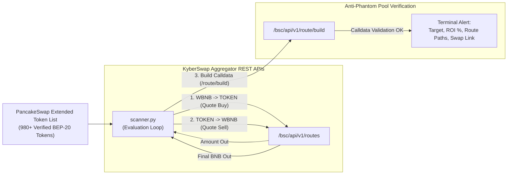

# ⚡ BSC Real-Time Arbitrage & Route Scanner

[](LICENSE)
[](https://www.python.org/)
[](https://bscscan.com)
[](https://kyberswap.com)

> ℹ️ **Operational Mode & Read-Only Disclosure**:  
> This software is a **read-only telemetry scanner and route simulation bot**. It queries real-time liquidity aggregator APIs to calculate net triangular/cross-pair arbitrage spreads between native BNB and hundreds of BEP-20 tokens. **Automated transaction signing is disabled by design**: the tool holds zero private keys, stores no mnemonic phrases, and requires no wallet connection.

---

## 🏛️ How It Works



1. **Live Token Ingestion:** Pulls active verified tokens directly from PancakeSwap's extended token list (`pancakeswap-extended.json`).
2. **Dual-Leg Route Quoting:** Queries KyberSwap Aggregation API for `WBNB -> Token` and reverse `Token -> WBNB` quotes at specified trade sizes.
3. **Spread Calculation:** Computes net profit percentage taking into account estimated gas and routing fees.
4. **Anti-Phantom Safeguard:** Calls `/route/build` to verify whether the routing contract can actually generate valid, executable calldata before issuing an alert (filtering out honeypots and dead liquidity pools).

---

## 🚀 Getting Started

### Prerequisites
- Python 3.10 or higher
- An active internet connection (to reach KyberSwap API endpoints)

### Installation

```bash
# Clone the repository
git clone https://github.com/Lukecele/bsc-arbitrage-scanner.git
cd bsc-arbitrage-scanner

# Create and activate virtual environment
python3 -m venv venv
source venv/bin/activate  # On Windows: venv\Scripts\activate

# Install dependencies
pip install -r requirements.txt
```

### Running the Scanner

```bash
python scanner.py
```

### Configuration Parameters (inside `scanner.py`)

| Parameter | Default | Description |
| :--- | :--- | :--- |
| `BNB_INPUT_AMOUNT` | `0.005` | Simulation size in native BNB per arbitrage loop. |
| `MIN_PROFIT_PCT` | `1.2` | Minimum net profit percentage required to trigger an alert. |
| `TOKEN_LIST_URLS` | PancakeSwap | Remote URLs providing verified chain tokens. |

---

## 📜 License

Distributed under the [MIT License](./LICENSE). Open-source research tool for on-chain telemetry and DeFi developers.
