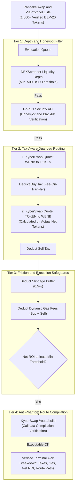

# ⚡ BSC Full-Friction Arbitrage & Route Scanner

[](LICENSE)
[](https://www.python.org/)
[](https://bscscan.com)
[](https://kyberswap.com)
[](https://gopluslabs.io)
[](https://dexscreener.com)
[](https://github.com/Lukecele/bsc-arbitrage-scanner)

> ℹ️ **Operational Mode & Read-Only Disclosure**:  
> This software is a **production-grade read-only telemetry scanner and multi-friction route simulation engine**. It queries real-time DEX liquidity aggregators, on-chain token security APIs, and liquidity depth feeds to identify authentic triangular/cross-pair arbitrage spreads between native BNB and verified BEP-20 tokens.  
> **Automated transaction signing is disabled by design**: the tool holds zero private keys, stores no mnemonic phrases, and requires no wallet connection.

---

## 🏛️ Architecture & Full-Friction Model

Standard arbitrage scanners frequently trigger **false-positive alerts** because they only evaluate naive theoretical spot price ratios, ignoring on-chain transaction taxes, liquidity pool depths, and execution slippage. 

This engine implements a **4-Tier Defense & Real-World Friction Model**:



### 1. 🏷️ Tax-Aware Execution (Fee-On-Transfer Protection)
Tokens with transfer taxes (e.g. 4% transfer tax on `$ARB INC` or community utility tokens) create false arbitrage signals in basic bots.
- Automatically queries **GoPlus Security API** to detect on-chain `buy_tax` and `sell_tax`.
- Deducts `buy_tax` from Leg 1: only the *actual tokens received* on-chain are fed into Leg 2 sell quote.
- Deducts `sell_tax` from Leg 2 to determine the true gross BNB output.
- Rejects honeypots (`is_honeypot == 1`) and tokens with punitive taxes (`> 10%`).

### 2. 💧 Pool Depth & Liquidity Thresholds
- Queries **DEXScreener** for total aggregated pool liquidity across all DEX pairs.
- Automatically filters out dead pools and low-liquidity pairs (`< $500 USD`) where order execution would suffer extreme price impact.

### 3. 🛡️ Realistic Slippage & Dynamic Gas Friction
- Applies an execution slippage tolerance buffer (`SLIPPAGE_BUFFER_PCT = 0.5%`).
- Extracts live gas estimates (`gas` × `gasPrice`) from both route legs and subtracts the exact BNB gas fee from the final balance.
- Computes **True Net Realized Profit**:
  $$\text{Net Realized BNB} = \Big(\text{Gross BNB} \times (1 - \text{Sell Tax}) \times (1 - \text{Slippage})\Big) - \text{Total Gas} - \text{Input BNB}$$

### 4. 🔍 Anti-Phantom Pool Verification
- Calls `/route/build` with explicit slippage tolerance to ensure the KyberSwap routing smart contract can compile real bytecode and calldata without failing on-chain.

---

## 💻 Terminal Telemetry Output

When a genuine, friction-cleared arbitrage opportunity is identified, the engine prints a comprehensive telemetry report:

```text
⚡⚡⚡⚡⚡⚡⚡⚡⚡⚡⚡⚡⚡⚡⚡⚡⚡⚡⚡⚡⚡⚡⚡⚡⚡⚡⚡⚡⚡⚡⚡⚡⚡⚡⚡⚡
🚨 OPPORTUNITÀ ARBITRAGGIO VERIFICATA: Arb Inc (Arbitrage Inception)
📍 Indirizzo Target  : 0x5EE54869Ecd5E752C31aF095187326D4A4D50e1c
💧 Profondità Pool   : $1,593.41 USD
🏷️  Token Transfer Tax: Buy 4.0% | Sell 3.8%
📊 Spread Teorico    : +6.42% (Lordo senza attriti)
🛡️  Buffer Slippage   : -0.5%
⛽ Costo Gas Stimato : -0.00048 BNB (~$0.340)
💎 PROFITTO NETTO    : +1.64% (+0.00008 BNB)
🛒 Percorso Buy      : PancakeSwap v2 -> Biswap
💰 Percorso Sell     : PancakeSwap v3 -> PancakeSwap v2
🔗 Swap Diretto      : https://arbitrage-inc.exchange/swap?tokenOut=0x5EE54869Ecd5E752C31aF095187326D4A4D50e1c
⚡⚡⚡⚡⚡⚡⚡⚡⚡⚡⚡⚡⚡⚡⚡⚡⚡⚡⚡⚡⚡⚡⚡⚡⚡⚡⚡⚡⚡⚡⚡⚡⚡⚡⚡⚡
```

---

## 🚀 Getting Started

### Prerequisites
- Python 3.10 or higher
- Network access to BSC aggregator and security endpoints

### Installation

```bash
# Clone the repository
git clone https://github.com/Lukecele/bsc-arbitrage-scanner.git
cd bsc-arbitrage-scanner

# Create and activate virtual environment
python3 -m venv venv
source venv/bin/activate  # On Windows: venv\Scripts\activate

# Install dependencies
pip install -r requirements.txt
```

### Running the Scanner

```bash
python scanner.py
```

### Configuration Parameters (inside `scanner.py`)

| Parameter | Default | Description |
| :--- | :---: | :--- |
| `BNB_INPUT_AMOUNT` | `0.005` | Simulation size in native BNB per arbitrage cycle. |
| `MIN_PROFIT_PCT` | `1.0` | Minimum **real net profit** % required to trigger an alert (after taxes, slippage, and gas). |
| `SLIPPAGE_BUFFER_PCT` | `0.5` | Dynamic execution slippage buffer subtracted from simulated output. |
| `MIN_POOL_LIQUIDITY_USD` | `500` | Minimum pool depth in USD required to evaluate a token (filters illiquid pairs). |
| `MAX_ALLOWED_TAX_PCT` | `10.0` | Maximum allowable transfer tax (ignores honeypots and scam tokens). |
| `ARB_INC_TOKEN` | `0x5EE5...` | Fixed monitoring address for Arbitrage Inception token. |

---

## 🔗 Ecosystem Integration

This scanner is an open telemetry tool developed for the **[Arbitrage Inception Ecosystem](https://arbitrage-inc.exchange)**, supporting cross-DEX liquidity research and decentralized arbitrage monitoring on BNB Smart Chain.

---

## ⭐ Support the Project

If you find this arbitrage scanner or multi-friction simulation engine useful for your research, bots, or DeFi development, please consider dropping a **Star** on GitHub. It directly supports open-source maintenance and ecosystem tooling!

[](https://github.com/Lukecele/bsc-arbitrage-scanner)

---

## 📜 License

Distributed under the [MIT License](./LICENSE). Open-source research tool for on-chain telemetry and DeFi developers.
